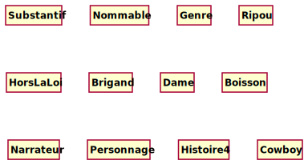
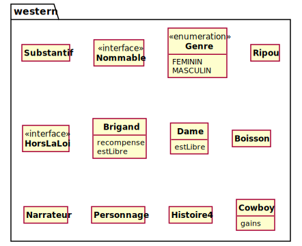
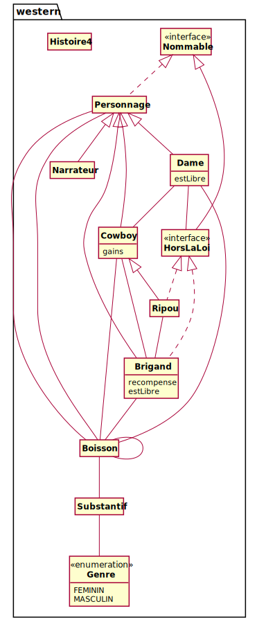
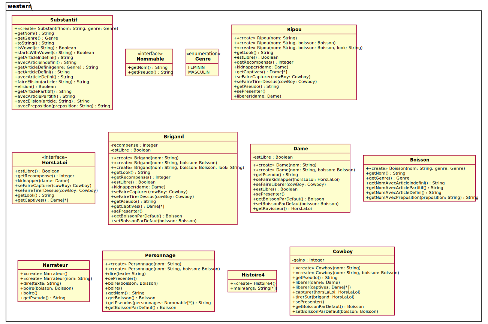

P21-P22 SAE21 2023  
SCR - IUT R. Schuman

Projet *PumlFromJava*
---

L'objectif du projet est de générer automatiquement le source PlantUML de diagrammes de classes UML (DCA et DCC)
pour des éléments qui figurent dans un ou des packages et/ou un ou plusieurs fichiers sources Java.  
Le projet inclue la définition et la réalisation d'une API et d'une commande qui utilise cette API 
pour produire le source PlantUml des diagrammes.  
L'API est un package Java qui définit pour chaque élément du langage UML une classe.  
Cette classe permet de produire le code PlantUML pour cet élément.

On ne traite pas :
- les types imbriquées
- les types génériques
- les modules

##### Semaine 1 : les *doclets* de javadoc

> ###### Objectif
> Prendre en main `javadoc`, les *doclets* et leurs options
afin de générer dans un fichier `.puml` un diagramme énumérant
les éléments sélectionnés.

- Compiler les fichiers `Java2Puml.java` et `FirstDoclet.java`.
- Lancer manuellement, sur la ligne de commande, la commande `javadoc` pour exécuter le doclet `FirstDoclet` 
  pour le package `western` avec les options nécessaires (voir l'indication dans `Java2Puml`).
- Dans IntelliJ, configurer l'exécution de `Java2Puml` pour lancer `javadoc` et l'exécution du doclet ;
  compléter les arguments de la ligne de commande avec les options nécessaires
- Faire un diagramme de séquence qui modélise l'appel d'un doclet 
  (voir la description dans la documentation de l'interface [`Doclet`](https://docs.oracle.com/en/java/javase/18/docs/api/jdk.javadoc/jdk/javadoc/doclet/Doclet.html))
- Faire un DCA et un DCC des interfaces et classes utiles pour l'utilisation des doclets.  
  Faire figurer uniquement les éléments qui vous semblent utiles pour la réalisation du projet.
- Écrire le code d'un doclet `PumlDoclet` qui :
    - génére dans un fichier `.puml` un diagramme de classe (faire une classe `PumlDiagram`) 
      qui comporte les classes, les interfaces et les énumérations inclus dans les éléments spécifiés.
    - prend en compte deux options `Doclet.Option` nommées :  
        - `-out` : pour fixer le nom du fichier `.puml` créé;  
           par défaut le nom est celui du premier élément sélectionné 
        - `-d` : pour fixer le répertoire dans lequel le fichier `.puml` est placé;  
           par défaut, ce répertoire est le répertoire courant
          
###### Exemple de diagramme généré pour le package western

  
###### Rendus :
  - DS `Doclet`, DCA et DCC des classes `Doclet`
  - le source de la commande `Java2Puml` et du doclet `PumlDoclet`
  - rapport hebdomadaire

###### En savoir plus :
- [la commande `javadoc`](https://docs.oracle.com/en/java/javase/18/docs/specs/man/javadoc.html)
- [l'interface `Doclet`](https://docs.oracle.com/en/java/javase/18/docs/api/jdk.javadoc/jdk/javadoc/doclet/Doclet.html)
- [l'interface `Doclet.Option`](https://docs.oracle.com/en/java/javase/18/docs/api/jdk.javadoc/jdk/javadoc/doclet/Doclet.Option.html)
- [l'interface `ToolProvider`](https://download.java.net/java/GA/jdk14/docs/api/java.base/java/util/spi/ToolProvider.html) 
- [le package `jdk.javadoc.doclet`](https://docs.oracle.com/en/java/javase/19/docs/api//jdk.javadoc/jdk/javadoc/doclet/package-summary.html)
- [Using the new Doclet API](https://openjdk.org/groups/compiler/using-new-doclet.html)
- [Processing code](https://openjdk.org/groups/compiler/processing-code.html)
- [javadoc Architecture](https://openjdk.org/groups/compiler/javadoc-architecture.html)

##### Semaine 2 : Java Langage API et DCA sans associations

> ###### Objectif
> - Modéliser l'API *Java Language Model*
> - Produire le DCA sans les associations.  
  A ce stade le DCA produit montre les classes, interfaces et énumérations
  avec les noms des attributs caractéristiques (attributs dont le type est un type primitif)
  et les noms des constantes pour les énumérations.

Le doclet a accès aux éléments à travers son environnement (`DocletEnvironment`) 
- Faire le DCC de l'API *Java Language Model* (package `javax.lang.model`) 
  à partir de l'interface `Element` (`javax.lang.model.element.Element`)
- Démarrer la conception de l'API `Java2Puml` pour générer le DCA sans associations
- Générer le DCA sans relation pour les classes et/ou packages passés à `javadoc`

###### En savoir plus :

- [le package `javax.lang.model`](https://docs.oracle.com/en/java/javase/19/docs/api/java.compiler/javax/lang/model/package-summary.html)
- [l'interface `javax.lang.model.Element`](https://docs.oracle.com/en/java/javase/19/docs/api//java.compiler/javax/lang/model/element/Element.html)

###### Exemple de diagramme généré à ce stade pour le package western

###### Rendus:
- DCC de Java Language API
- DCA et DCC API `pumlFromJava`
- commande `Java2Puml` de production d'un DCA sans relations
- rapport hebdomadaire

#### Semaine 3 : Amélioration du DCA

> ###### Objectif
> Produire le DCA avec les associations :
> - les généralisations et les réalisations
> - les agrégations

Le DCA ne montre que les associations qui concernent les éléments spécifiés pour l'établissement du diagramme.
Les associations produites ne sont pas nommées et sont données sans les multiplicités.
Les généralisations et les réalisations peuvent être produites automatiquement à partir de la superclasse 
et des interfaces implémentées.
Les agrégations sont déduites des variables d'instance et de classe qui n'ont pas un type primitif.
Les agrégations ne sont pas caractérisées dans le DCA.
Les relations de dépendance ne seront traitées qu'en semaine 5.

###### Exemple de diagramme généré à ce stade pour le package western

###### En savoir plus :

- [l'interface `javax.lang.model.TypeElement`](https://docs.oracle.com/en/java/javase/19/docs/api//java.compiler/javax/lang/model/element/TypeElement.html)
- [l'interface `javax.lang.model.VariableElement`](https://docs.oracle.com/en/java/javase/19/docs/api//java.compiler/javax/lang/model/element/VariableElement.html)

###### Rendus:
- DCCs et DCAs mis à jour
- sources des classes
- rapport hebdomadaire

    
#### Semaine 4 : Production d'un premier DCC

> ###### Objectif
> Produire un DCC sans les associations.  
> Ajouter au doclet une option `--dca` pour demander la production du DCA .  
> Par défaut, le diagramme produit sera le DCC.

Le DCC produit doit :
- traiter les attributs : visibilité, nom, type UML
- traiter les opérations : visibilité, nom, avec leur paramètres et leurs types
- gérer les modificateurs (`abstract`, `static`, `final`)
- traiter les multiplicités pour les attributs, paramètres et résultats des opérations

###### Exemple de diagramme généré à ce stade pour le package western

###### En savoir plus :

- [l'interface `javax.lang.model.TypeElement`](https://docs.oracle.com/en/java/javase/19/docs/api//java.compiler/javax/lang/model/element/TypeElement.html)
- [l'interface `javax.lang.model.VariableElement`](https://docs.oracle.com/en/java/javase/19/docs/api//java.compiler/javax/lang/model/element/VariableElement.html)
- [l'interface `javax.lang.model.ExecutableElement`](https://docs.oracle.com/en/java/javase/19/docs/api//java.compiler/javax/lang/model/element/ExecutableElement.html)

###### Rendus:
- DCCs et DCAs mis à jour
- sources des classes
- rapport hebdomadaire

#### Semaine 5 : Associations et dépendances

> ###### Objectif
> Produire le DCA et le DCC avec toutes les associations.

Le DCC produit doit :
- orienter et caractériser les associations
- traiter les rôles (nom, visibilité, multiplicité)
- rajouter les dépendances.

Le DCA produit doit :  
- faire figurer les dépendances sous la forme d'une relation non nommée.  
  Dans le DCA, les dépendances ne sont pas caractérisées.

###### Rendus:
- DCCs et DCAs mis à jour
- sources des classes
- rapport hebdomadaire

#### Semaine 6

> ###### Objectif
>- Préparation du rendu final et de la présentation

###### Extensions possibles:

1. Indiquer les redéfinitions pour les méthodes marquées `@Override`

2. Utilisation des tags de documentation pour compléter manuellement
   certains renseignements à porter sur le diagramme de classe 
   quand ceux-ci ne peuvent pas se trouver automatiquement dans le code. 
   - `@pumlType` pour les multiplicités
   - `@pumlAssociation` pour nommage
   - `@pumlAggregation` et `@pumlComposition`
   ...
   Cette extension implique la lecture et l'inspection des commentaires de documentation.

###### Rendus: Rendu final
- tous les DCCs et DCAs à jour
- tous les sources des classes
- rapport hebdomadaire avec conclusion

###### En savoir plus :

- [l'interface AnnotatedConstruct](https://docs.oracle.com/en/java/javase/19/docs/api/java.compiler/javax/lang/model/AnnotatedConstruct.html)
- [la classe DocTrees](https://docs.oracle.com/en/java/javase/19/docs/api/jdk.compiler/com/sun/source/util/DocTrees.html)  

